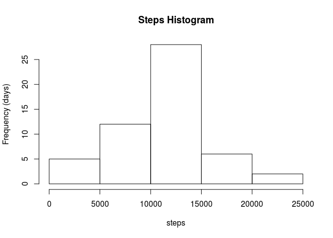
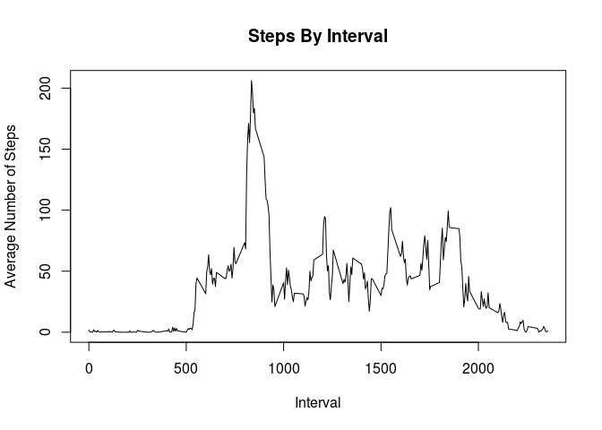
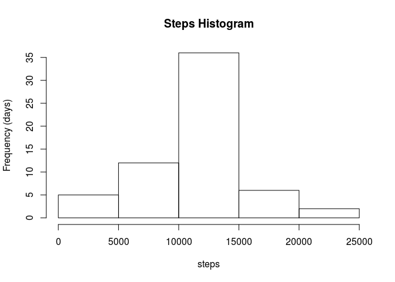
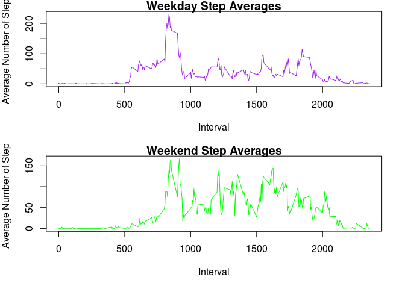
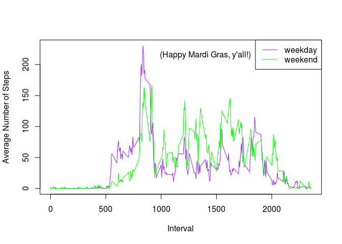

# Reproducible Research: Peer Assessment 1


### Introduction
This is an R Markdown document to convey the results of some basic analysis of data from a personal activity monitoring device. This device collects data at 5 minute intervals through out the day. The data consists of two months of data from an anonymous individual collected during the months of October and November, 2012 and include the number of steps taken in 5 minute intervals each day.


### Loading and preprocessing the data

Download and unzip the file.

```r
setwd("/home/rob/Data Science/reproducibleresearch/week2/RepData_PeerAssessment1") # Author use only.
data_url = "https://d396qusza40orc.cloudfront.net/repdata%2Fdata%2Factivity.zip"
if(!file.exists("repdata%2Fdata%2Factivity.zip")){
    download.file(data_url, "repdata%2Fdata%2Factivity.zip")
}
unzip("repdata%2Fdata%2Factivity.zip")
```

Load the data set

```r
activity <- read.csv("activity.csv")
```

### What is mean total number of steps taken per day?

The histogram below shows how many days, of the 61 days that data were collected over, contained the various amounts of steps.  For example, most days saw between 5000 and 20,000 steps taken. 


```r
step_sum_by_date <- tapply(activity$steps, activity$date, sum)
hist(step_sum_by_date, 
     main = "Steps Histogram", 
     xlab = "steps", 
     ylab = "Frequency (days)")
```

<!-- -->

The mean and the median step totals by day are calculated below.

```r
mean(step_sum_by_date, na.rm = TRUE)
```

```
## [1] 10766.19
```

```r
median(step_sum_by_date, na.rm = TRUE)
```

```
## [1] 10765
```

### What is the average daily activity pattern?

Here we produce a time series plot of the 5-minute interval (x-axis) and the average number of steps taken, averaged across all days (y-axis).  Note that the maximum recorded number of steps was taken at interval 835, corresponding to 8:35 A.M.


```r
step_mean_by_interval <- tapply(activity$steps, as.factor(activity$interval), mean, na.rm = TRUE)
intervals <- unique(activity$interval)
plot(intervals, step_mean_by_interval, type = "l",
     main = "Steps By Interval",
     xlab = "Interval",
     ylab = "Average Number of Steps"
     )
```

<!-- -->

```r
which(step_mean_by_interval == max(step_mean_by_interval))
```

```
## 835 
## 104
```


### Imputing missing values

Note that there are a number of days/intervals where there are missing
values (coded as `NA`). The presence of missing days may introduce
bias into some calculations or summaries of the data.

1. Calculate and report the total number of missing values in the dataset (i.e. the total number of rows with `NA`s)

```r
no_steps <- is.na(activity$steps)
length(activity$steps[no_steps])
```

```
## [1] 2304
```

2. Devise a strategy for filling in all of the missing values in the dataset.  We will replace `NA`s with the mean for that 5-minute interval.

```r
act_steps <- activity$steps
 for(n in 1:length(act_steps)){
     if(is.na(act_steps[n])){
         temp_int <- activity$interval[n]
         act_steps[n] <-step_mean_by_interval[as.character(temp_int)]
     }
 }
```


3. Create a new dataset that is equal to the original dataset but with the missing data filled in.


```r
activity2 <- activity
activity2$steps <- act_steps
```


4. Make a histogram of the total number of steps taken each day and Calculate and report the **mean** and **median** total number of steps taken per day. Do these values differ from the estimates from the first part of the assignment? What is the impact of imputing missing data on the estimates of the total daily number of steps?


```r
step_sum_by_date2 <- tapply(activity2$steps, activity2$date, sum)
hist(step_sum_by_date2, 
     main = "Steps Histogram", 
     xlab = "steps", 
     ylab = "Frequency (days)")
```

<!-- -->

The mean and the median (with NA data for comparison).  Note that mean did not change by imputing the data, as means were used for the imputed data. The median did change, though only by approximately 0.01%.

```r
mean(step_sum_by_date2)
```

```
## [1] 10766.19
```

```r
mean(step_sum_by_date, na.rm = TRUE)
```

```
## [1] 10766.19
```

```r
median(step_sum_by_date2)
```

```
## [1] 10766.19
```

```r
median(step_sum_by_date, na.rm = TRUE)
```

```
## [1] 10765
```

### Are there differences in activity patterns between weekdays and weekends?

1. Create a new factor variable in the dataset with two levels -- "weekday" and "weekend" indicating whether a given date is a weekday or weekend day.


```r
activity2$day <- ifelse(weekdays(as.Date(activity2$date)) %in% c("Saturday", "Sunday"), "weekend", "weekday")
```

1. Make a panel plot containing a time series plot (i.e. `type = "l"`) of the 5-minute interval (x-axis) and the average number of steps taken, averaged across all weekday days or weekend days (y-axis). 


```r
step_mean_by_interval2 <- tapply(activity2$steps, as.factor(activity2$interval), mean)
weekday_steps <- activity2[activity2$day == "weekday", 1]
weekday_ints <- activity2[activity2$day == "weekday", 3]
weekday_step_means <- tapply(weekday_steps, weekday_ints, mean)
weekend_steps <- activity2[activity2$day == "weekend", 1]
weekend_ints <- activity2[activity2$day == "weekend", 3]
weekend_step_means <- tapply(weekend_steps, weekend_ints, mean)

par(mfcol = c(2, 1), mar = c(5,4,1,2))
plot(intervals, weekday_step_means, 
     type = "l", 
     col = "purple",
     main = "Weekday Step Averages",
     xlab = "Interval",
     ylab = "Average Number of Steps"
     )
plot(intervals, weekend_step_means, 
     type = "l", 
     col = "green",
     main = "Weekend Step Averages",
     xlab = "Interval",
     ylab = "Average Number of Steps"
     )
```

<!-- -->

For comparison, here are the two plots on the same graph.


```r
plot(intervals, weekday_step_means, 
     type = "l", 
     col = "purple",
     xlab = "Interval",
     ylab = "Average Number of Steps"
     )
lines(intervals, weekend_step_means, col = "green")
legend("topright", 
       legend = c("weekday", "weekend"), 
       col = c("purple", "green"),
       lty = 1
       )
text(1400, 215, "(Happy Mardi Gras, y'all!)")
```

<!-- -->

So the behavior isn't grossly dissimilar between weekends and weekdays.  Weekdays have the greater maximum step count, at about the same time of day.  However weekends tended to be more active around mid-afternoon.
